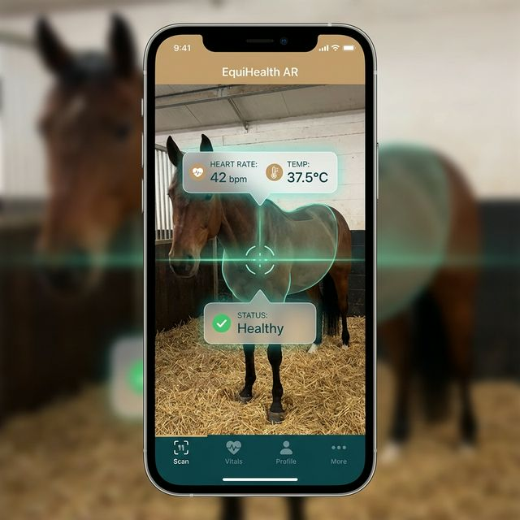
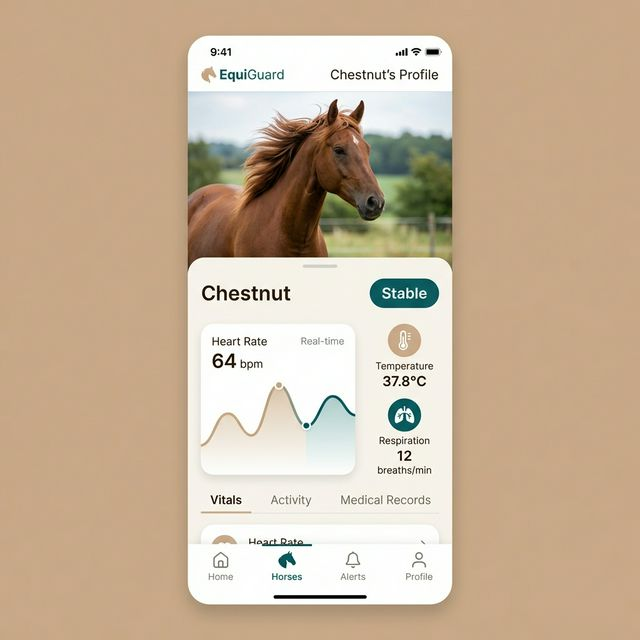

# EquiGuard - Smart Horse Health Monitoring System


**EquiGuard** is a next-generation equine health monitoring system powered by IoT and Artificial Intelligence. This app allows stable owners and veterinarians to monitor the real-time health, location, and activity of their horses, ensuring early detection of critical conditions like Colic.

## 🚀 Key Features

- **Real-time Vitals**: Monitor Heart Rate, Temperature, and Respiration 24/7.
- **🔮 AI Health Prediction**: Proprietary algorithms analyze data to predict health risks before they become critical.
- **🦄 AR Health Scan**: Augmented Reality feature to visualize horse stats in real-time using the camera.
- **📍 Live Geofencing**: Track horse location and get alerts if they leave safe zones.
- **📊 24h History**: Detailed interactive charts for deep health analysis.

## 🛠️ Technology Stack

- **Framework**: Flutter (Dart)
- **UI Design**: Material 3 + Glassmorphism (GlassKit)
- **Charts**: FL Chart
- **State Management**: Provider
- **Backend (Mock)**: Realistic Data Engine for prototyping

## 📸 Screenshots

| Dashboard | AR Scan | Horse Details |
|-----------|---------|---------------|
|  |  |  |

## 📦 Getting Started

1. **Clone the repository**:

    ```bash
    git clone https://github.com/mizatrix/smart-horse-monitoring-system.git
    ```

2. **Install Dependencies**:

    ```bash
    flutter pub get
    ```

3. **Run the App**:

    ```bash
    flutter run
    ```

---
*EquiGuard - The Future of Equine Intelligence*
